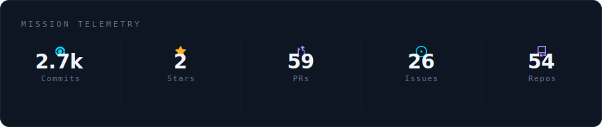

  

 

  

 

  

 

  

 

  

 

<strong>🚀 Sobre Mim</strong>

 

Construindo o futuro com código limpo e arquiteturas escaláveis.
Apaixonado por ecossistemas open-source e design centrado no usuário.

 

  
  

